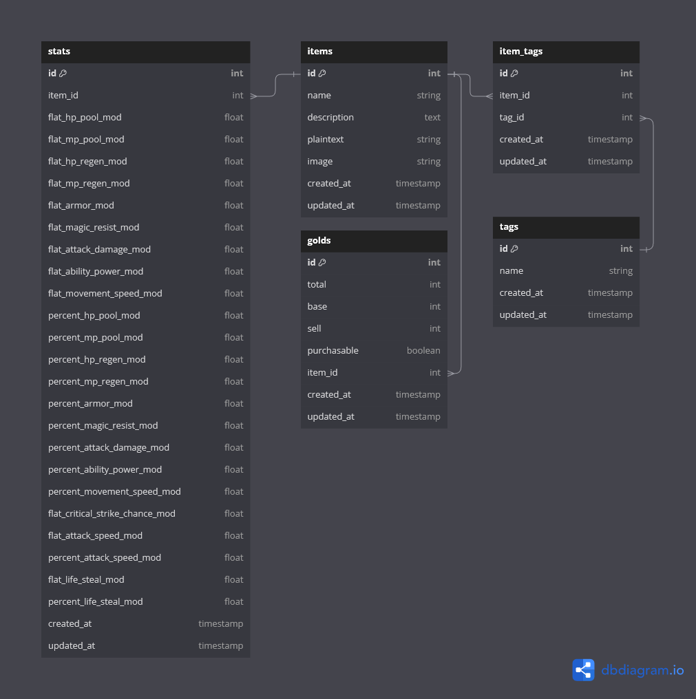

# lolitemshop

This is a Ruby on Rails project that I made for my Agile Full Stack Web Development class. It serves as a database for items in League of Legends. The project utilises the Riot Games API to fetch and display items, along with their stats and description. This project is styled using the Bulma CSS framework.

## Table of Contents

- [Description](#description)
- [ERD](#erd)
- [Features](#features)
- [Installation](#installation)
- [Acknowledgements](#acknowledgements)

## Description

This project pulls data from the League of Legends API and displays all available items in the game. Users can browse items, filter them by tags, search based on name, and sort them based on different criteria such as name or gold cost.

## ERD



## Features

- Fetch and display League of Legends items from the the Riot Games API.
- Paginated items with Kaminari, styled with Bulma CSS.
- Filter items by tags.
- Sort items alphabetically and by their cost in gold.
- Search items with a search bar, along with the respective tag.
- Ytem pages showing stats and attributes.
- Responsive design using Bulma CSS.

## Installation

### Setup

1. Clone the repository:

   ```sh
   git clone git@github.com:kdeluz/lolitemshop.git
   cd lolitemshop
   ```

2. Install the required gems:

   ```sh
   bundle install
   ```

3. Set up and migrate the database:

   ```sh
   rails db:create
   rails db:migrate
   rails db:seed
   ```

4. Run the Rails server:

   ```sh
   bin/rails server
   ```

5. Visit `http://localhost:3000` in the browser to view the project.

## Acknowledgements

- [Riot Games API](https://developer.riotgames.com/)
- [Bulma CSS Framework](https://bulma.io/)
- [Kaminari](https://github.com/kaminari/kaminari)